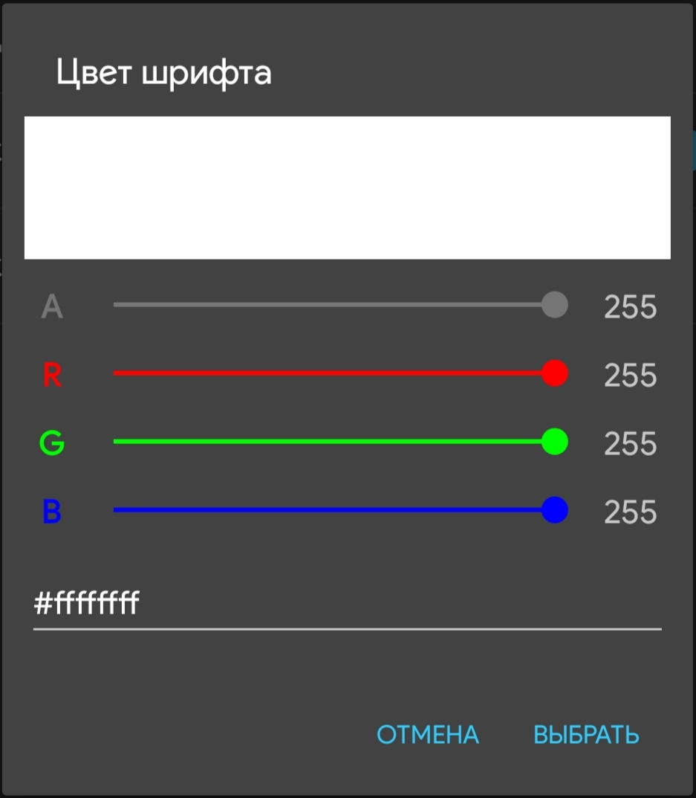

# ColorPicker
Простой диалог выбора цвета.

## Скриншот

 
## Как использовать?
Пример использования:
```java
new Picker(context) // создание экземпляра диалога
	.setTitle("Заголовок") // свой заголовок диалога
	.setColor(Color.RED) // изначально выбранный цвет
	/* .setColor("#FF0000") // или цвет в hex формате */
	.setOnColorSelect(new Picker.OnColorSelect() { // обработчик выбора

		@Override
		public void select(String hexColor) {
			// выбран цвет в формате #FF0000
		}

		@Override
		public void select(int intColor) {
			// выбран цвет
		}

		@Override
		public void cancel() {
			// выбор цвета отменён пользователем
		}
	})
	.show(); // запуск диалога
```
